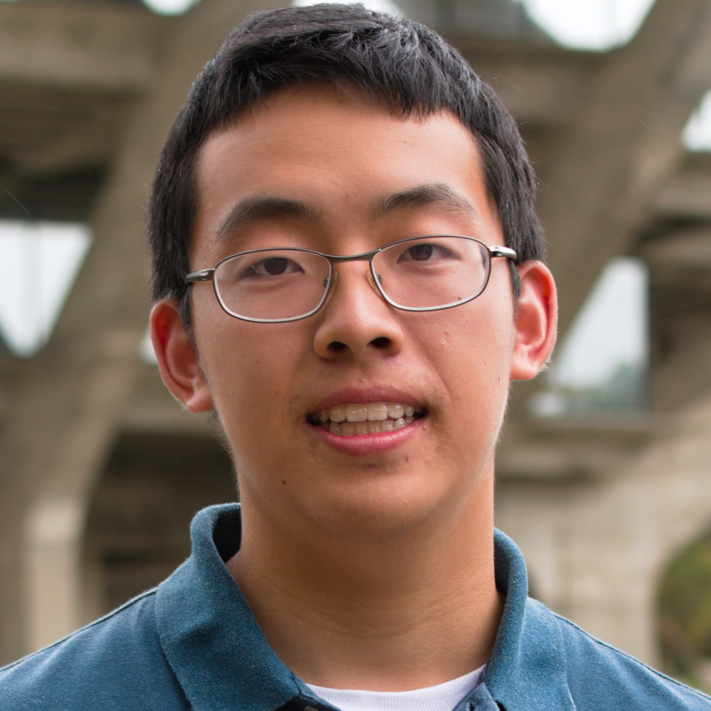

# Alan Wang's Github User Page



Hey, I'm Alan! I'm a second year college student at UCSD studying Computer Science.  
Currently looking for new opportunities and experiences to broaden my views of Software Engineering 

## Coding Experience
- **Java** 
  ```Java
  System.out.println("Hello world!");
  ```
- **C/C++**
  ```C
  printf("Good morning");
  ```
- **Python** 
  ```Python
  print("SSSnakesss")
  ```
- **ARM Assembly** 
- **R** 

## Hobbies/Interests 
- Playing video games
  > -Favorite video games:
  >     - League of Legends
  >     - Minecraft 
- Reading manga
- Watching anime 

## Future Goals 
- [ ] Learn Javascript 
- [ ] Find more projects to work on
- [ ] Gain additional internship experience 
  
## Links 
[Click here to access my links!](links.md)

